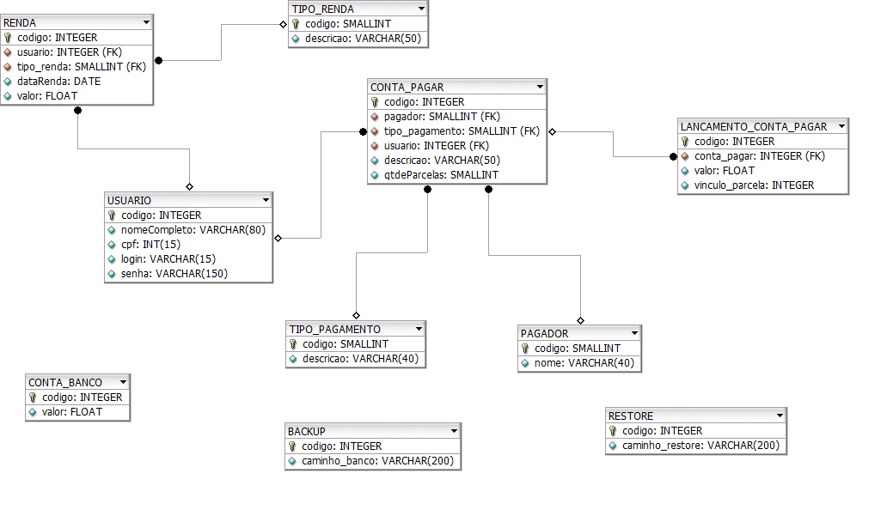

# Contas a pagar - api 
API para o sistema de contas a pagar que está sendo desenvolvido na linguagem Java na versão 11 com Spring.   
Sendo utilizado o banco de dados mysql em produção com flyway e o banco H2 para realização de testes de integração. Integração continua habilitado no GitHUb.

#
### Dependências Spring (até o momento)

- Spring Boot Dev Tools
- Spring Web
- Spring Data JPA
- Flyway Migration
- Mysql Driver
- H2 DataBase
- Junit
- Rest Assured

#
###  Instalação Windows e Linux

Para testar o projeto é necessário ter instalado um banco mysql rodando na porta 3306, com o usuário root e senha root.
Caso queira usar o banco de dados com outro usuário e senha é necessário alterar as configurações no arquivo application.properties do projeto.   
Utilizado a IDE Spring Tool Suite. 

#
###  Documentação - Diagrama de casos de uso do projeto completo

#
###  Documentação - Diagrama conceitual do projeto completo

#
###  Documentação - Diagrama entidade e relacionamento do projeto completo

